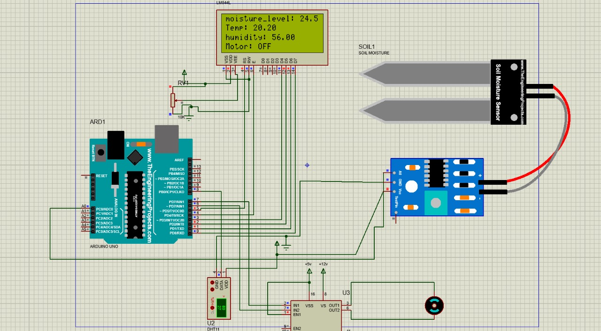

# Smart Irrigation System



## Overview

This Smart Irrigation System is designed to optimize water usage in agriculture by incorporating various sensors and actuators. The system utilizes ultrasonic, pH, temperature and humidity, soil moisture, and liquid crystal sensors to monitor environmental conditions and control irrigation accordingly. The embedded C code facilitates the communication and coordination between these components.

## Components

- **Ultrasonic Sensor**: Measures the water level in the water storage tank.\
- **pH Sensor**: Monitors the pH level of the soil.\
- **Temperature and Humidity Sensor**: Collects environmental data for better irrigation decisions.\
- **Soil Moisture Sensor**: Measures the moisture content of the soil.\
- **Liquid Crystal Sensor**: Provides a visual display of important system parameters.\
- **Motor**: Drives the pump for water circulation.\
- **Solenoid Valve**: Controls the flow of water to the irrigation system.\
- **Water Storage Tank**: Holds the water supply for irrigation.

## Features

- **Automatic Irrigation**: The system automatically triggers irrigation based on sensor readings.\
- **Real-time Monitoring**: Sensors continuously monitor environmental conditions.\
- **LCD Display**: Shows relevant information such as soil moisture, water level, and system status.\
- **Water Conservation**: Optimizes water usage to ensure efficient irrigation.

## Installation

1\. Clone the repository:

    ```
   https://github.com/alok2802/Smart-Irrigation-System
    ```

2\. Navigate to the project directory:

    ```
    cd Smart-Irrigation-System\
    ```

3\. Upload the embedded C code to your microcontroller.

## Usage

1\. Connect all sensors and actuators to the appropriate pins on your microcontroller.\
2\. Power on the system.\
3\. The LCD display will show real-time information.\
4\. The system will automatically control irrigation based on sensor readings.


## Dependencies

- Add any additional libraries or dependencies required by your code.

## Contributing

Feel free to contribute to the development of this project. Follow the [contribution guidelines](CONTRIBUTING.md) for more information.

## License

This project is licensed under the MIT License - see the [LICENSE](LICENSE) file for details.


---

